# 🚀 CivicAI – AI-Powered Smart Civic Incident Response & Navigation Platform


> **CivicAI** is an AI-powered smart governance platform that combines **Google Gemini AI, Conversational AI, Geospatial Intelligence, Smart Navigation, Analytics, and Community Participation** to transform how civic issues are reported, prioritized, and resolved.

---

# 🌐 Live Demo

### Frontend

https://civicai-hackathon-1db59.web.app

### Backend

https://civicai-backend-nynx.onrender.com

### Demo Video

https://drive.google.com/drive/folders/1PCh4Pfw5Rw2It3e0YojyL8tnwLNQM8Jr?usp=sharing

---

# 📌 Problem Statement

Traditional civic complaint systems suffer from:

* ❌ Slow response times
* ❌ Poor issue prioritization
* ❌ Limited citizen participation
* ❌ Lack of transparency
* ❌ Complex complaint filing processes

Citizens often do not know how to properly describe civic issues, while authorities struggle to efficiently prioritize and resolve incidents.

---

# 💡 Our Solution

CivicAI introduces an AI-powered smart governance ecosystem where:

* Citizens report issues using natural language.
* Google Gemini automatically analyzes incidents.
* AI assistants help create professional complaints.
* Geographic intelligence visualizes incidents.
* Navigation systems optimize emergency response.
* Community participation improves transparency.

---

# ✨ Key Features

## 🤖 Google Gemini AI Analysis

Automatically generates:

* Issue Category
* Severity Level
* Priority Score
* AI Summary

---

## 💬 Conversational AI Assistant

One of our flagship features.

Supports:

* English
* Hindi
* Hinglish

Example:

User:

> "Bhai gate ke paas bahut bada gaddha hai."

Assistant:

> "Achha. Yeh gaddha kahan par hai?"

The assistant:

* understands natural language,
* asks follow-up questions,
* creates structured complaints,
* auto-fills report forms.

---

## 📍 Geospatial Intelligence

* Interactive GIS Maps
* Nearby Issue Detection
* Reverse Geocoding
* Geographic Analytics
* Issue Visualization

---

## 🚗 Smart Navigation System

Built-in emergency response navigation:

* Browser Geolocation
* OSRM Route Generation
* Dynamic Route Polyline
* Distance Calculation
* ETA Prediction
* Step-by-step Directions
* Google Maps Integration

---

## 🏆 Gamification

* Civic Points
* Community Support
* Citizen Engagement
* Civic Champion Rankings

---

## 📊 Administrative Dashboard

Administrators can:

* Monitor incidents
* View analytics
* Prioritize emergencies
* Update issue status
* Track resolutions

---

# 🔄 End-to-End Workflow

```text
Citizen
      ↓
AI Assistant
      ↓
Image Upload
      ↓
Cloudinary
      ↓
Google Gemini AI
      ↓
Category + Severity + Priority
      ↓
MongoDB Atlas
      ↓
Dashboard Analytics
      ↓
GIS Visualization
      ↓
Community Support
      ↓
Admin Dashboard
      ↓
Navigation System
      ↓
Issue Resolution
```

---

# 🏗️ System Architecture

```text
                    Citizens
                        │
                        ▼
              React + Tailwind
                        │
                        ▼
                Express API
                        │
      ┌─────────┬────────┬────────┐
      │         │        │        │
      ▼         ▼        ▼        ▼
 MongoDB   Cloudinary  Gemini   Maps
 Atlas      Storage      AI      GIS
      │
      ▼
Admin Dashboard
      │
      ▼
Navigation System
```

---

# 🛠️ Technology Stack

## Frontend

* React.js
* Tailwind CSS
* Vite
* React Router
* Axios
* Leaflet

## Backend

* Node.js
* Express.js
* JWT Authentication
* Multer

## Database

* MongoDB Atlas
* Mongoose

## Artificial Intelligence

* Google Gemini API
* Google AI Studio

## Geospatial Technologies

* Leaflet
* OpenStreetMap
* Browser Geolocation API
* OSRM Routing Engine

## Cloud Services

* Firebase Hosting
* Cloudinary

---

# 🤖 Google Technologies Utilized

* Google Gemini API
* Google AI Studio
* Firebase Hosting
* Google Cloud Ecosystem

---
# 🔄 End-to-End CivicAI Workflow

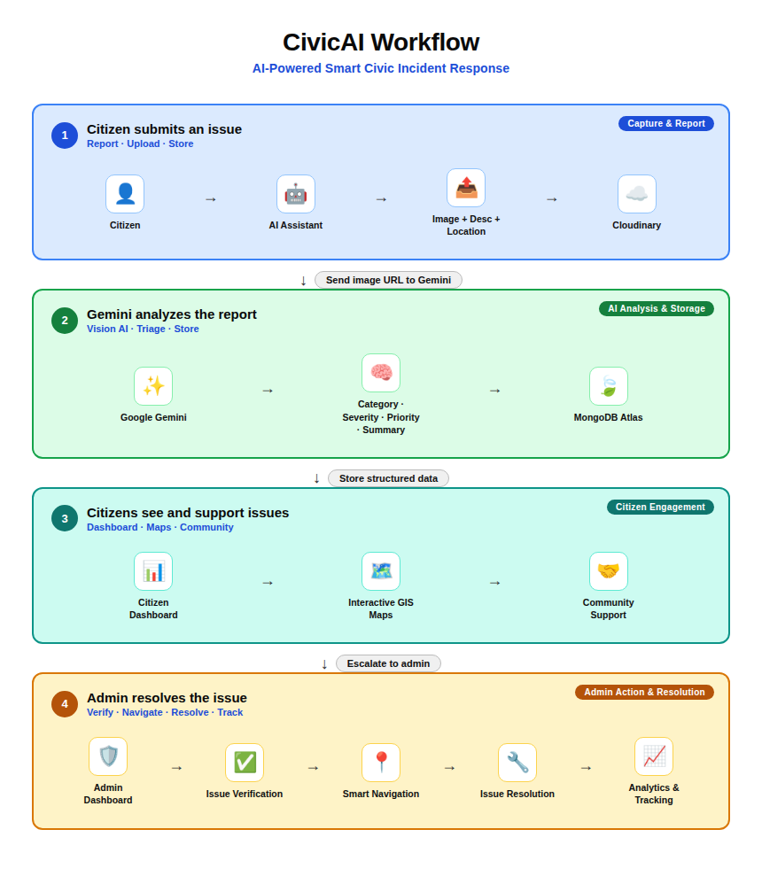

#  CivicAI Achitecture Diagram

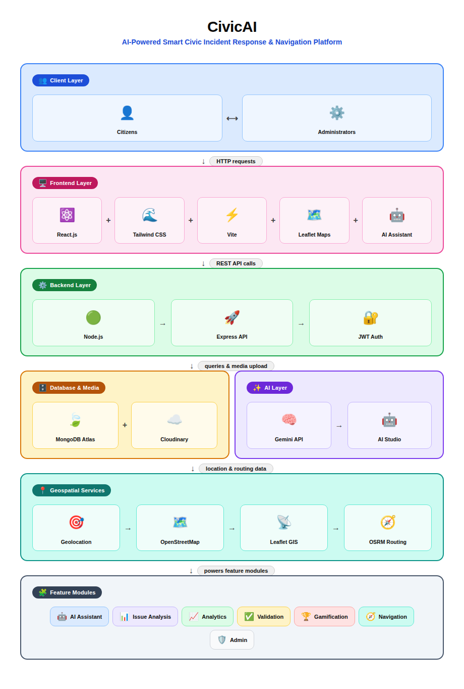

# 📸 Screenshots

## 🏠 Landing Page

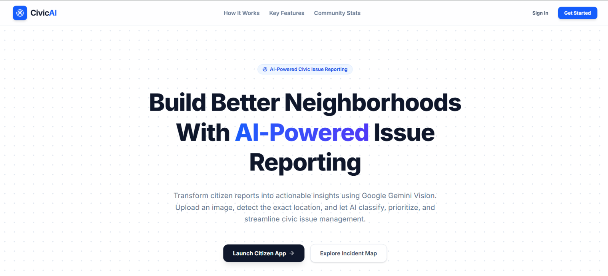

---

## ⚙️ How It Works

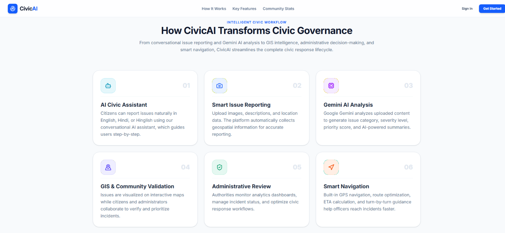

---

## ✨ Features Section

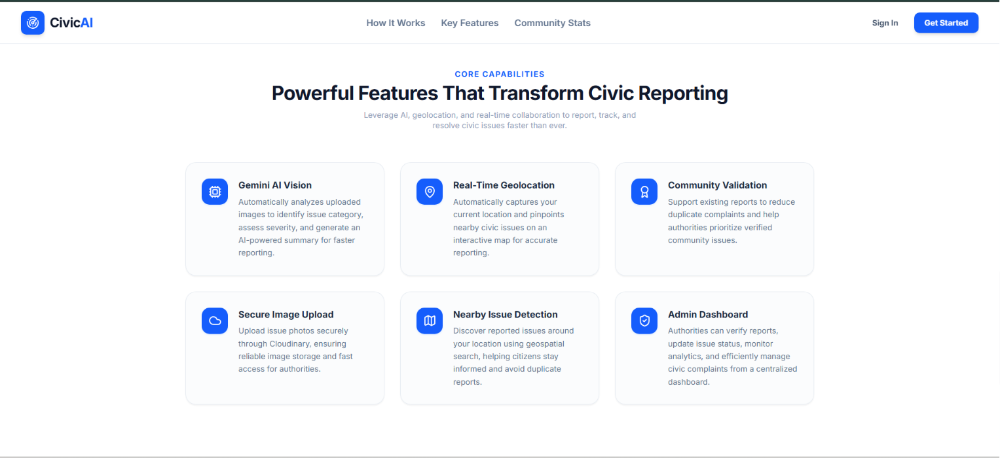

---

## 🔐 Login

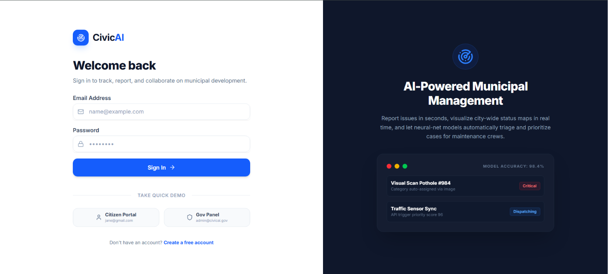

---

## 📝 Signup

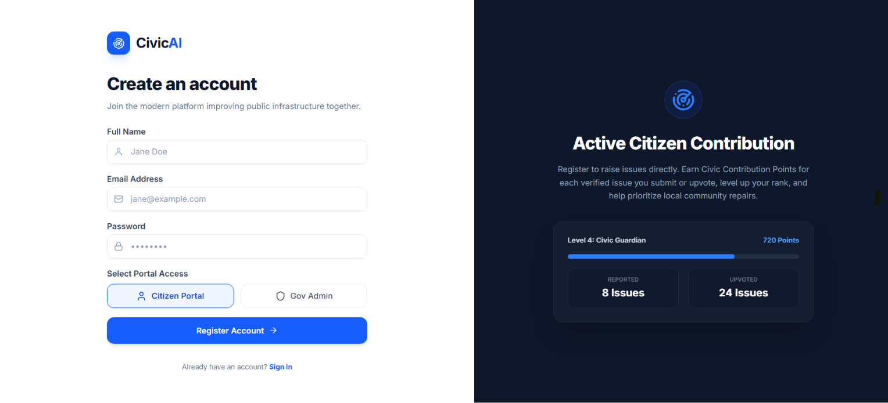

---

## 🤖 AI Conversational Assistant

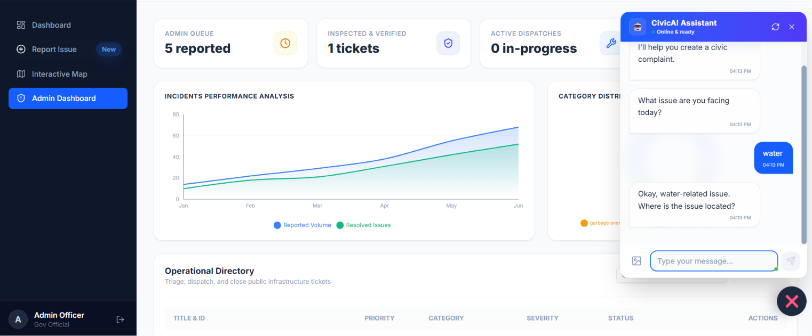

---

## 🧠 Google Gemini AI Analysis

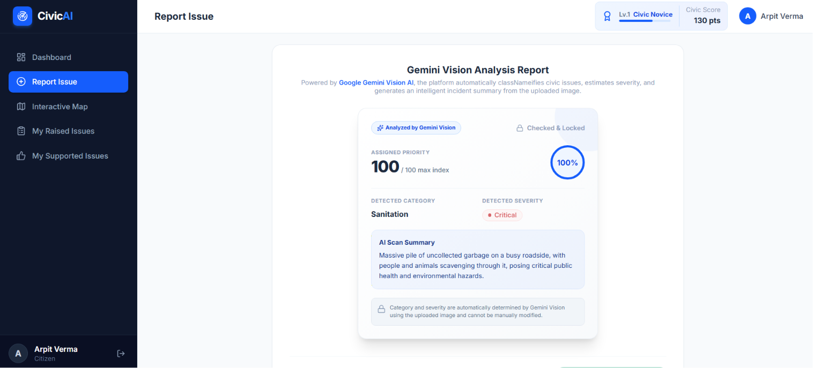

---

## 📊 Citizen Dashboard

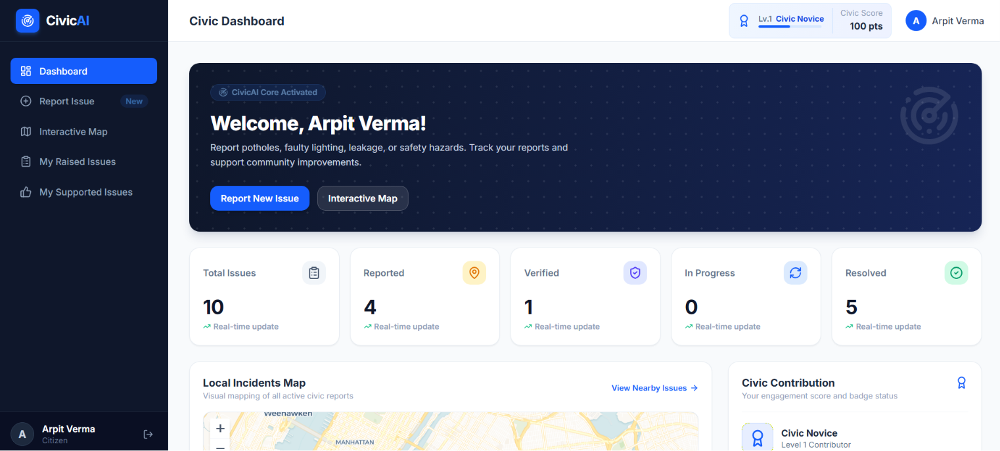

---

## 🗺️ Interactive GIS Map

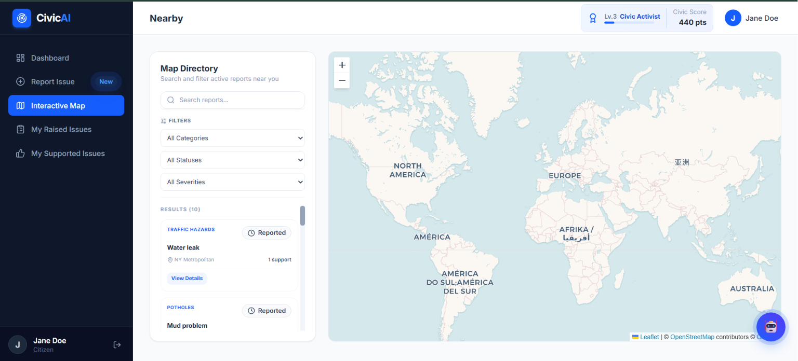

---

## 🚗 Smart Navigation Route

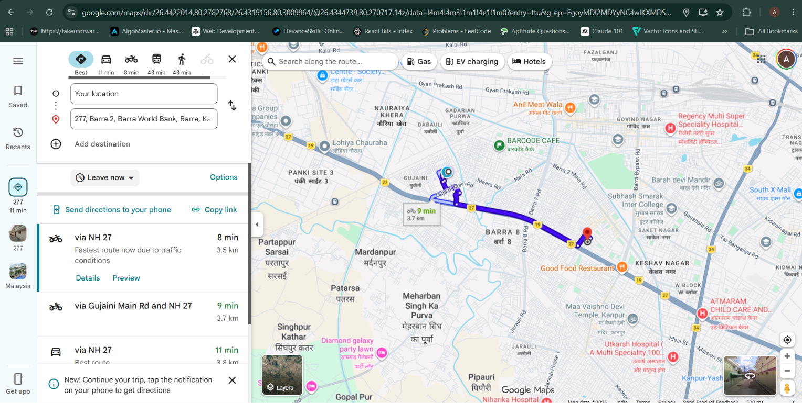

---

## 🧭 Step-by-Step Navigation

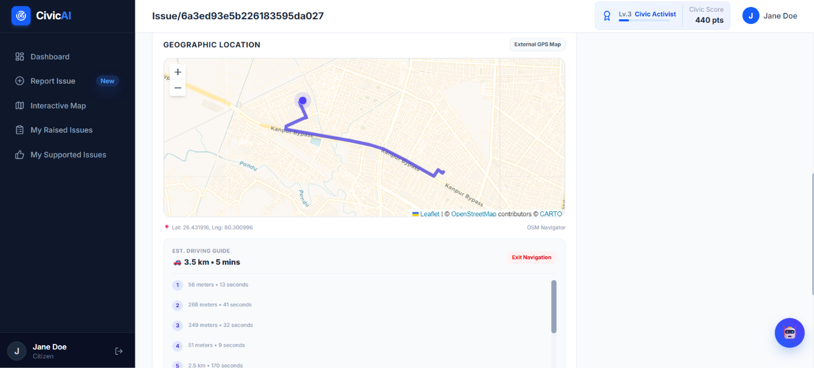

---

## 👮 Administrative Dashboard

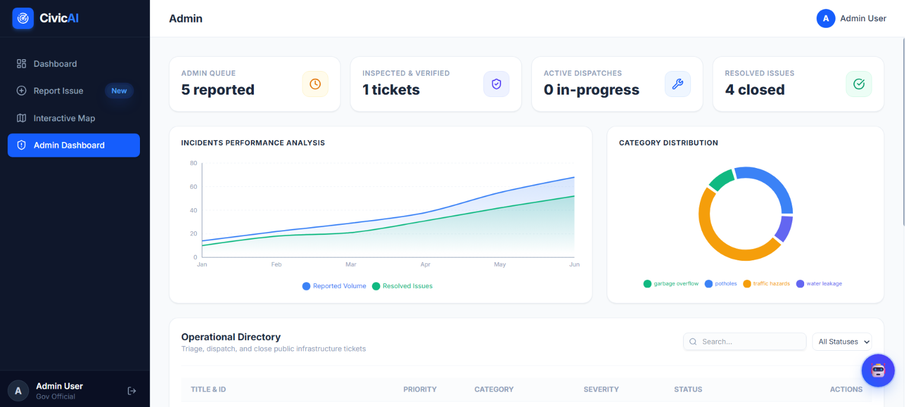


# 🚀 Deployment

| Component  | Platform          |
| ---------- | ----------------- |
| Frontend   | Firebase Hosting  |
| Backend    | Render            |
| Database   | MongoDB Atlas     |
| AI         | Google Gemini API |
| Storage    | Cloudinary        |
| Maps       | OpenStreetMap     |
| Navigation | OSRM              |

---

# 🔮 Future Scope

* Predictive Analytics
* Duplicate Detection AI
* Smart City Heatmaps
* Government API Integration
* Emergency Response Optimization
* Advanced GIS Analytics
* Multi-language Support Expansion

---

# 👨‍💻 AI-Assisted Development

This project was developed using an AI-augmented engineering workflow.

Tools used:

* Google AI Studio
* Gemini
* Claude AI
* Antigravity AI
* ChatGPT

These tools assisted with:

* Architecture Planning
* Prompt Engineering
* Debugging
* UI/UX Design
* Documentation
* Deployment

---

# 🙏 Acknowledgements

* Google Gemini API
* Google AI Studio
* Firebase
* MongoDB Atlas
* Cloudinary
* React
* Tailwind CSS
* Leaflet
* OpenStreetMap
* OSRM Routing Engine

---

⭐ If you found this project interesting, consider giving it a star on GitHub.
